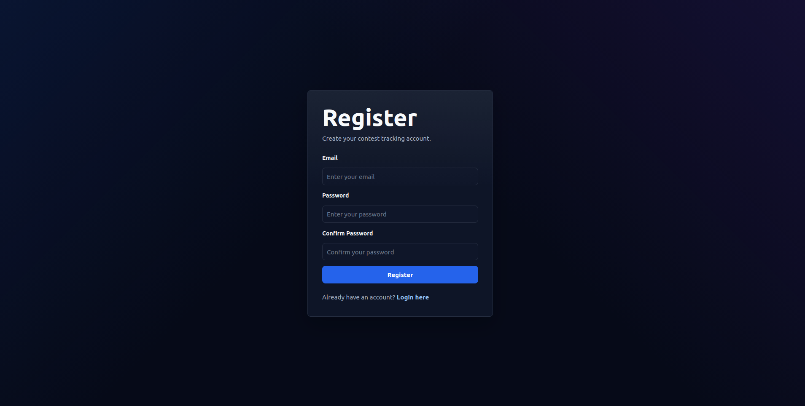
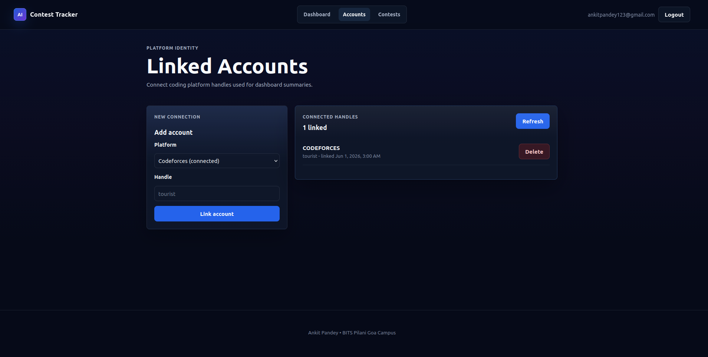
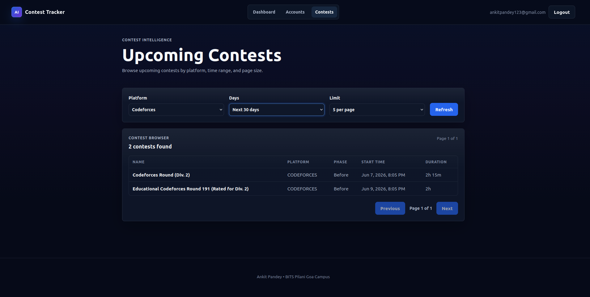

# AI Contest Tracker

A full-stack web application for tracking competitive programming contests and managing coding platform accounts.

Built using React, Node.js, Express, PostgreSQL, and Prisma.

---

## Features

### Authentication

* User registration and login
* JWT-based authentication
* Protected routes
* Persistent user sessions

### Dashboard

* Personalized dashboard
* Linked account summary
* Upcoming contest preview
* Codeforces profile integration

### Linked Accounts

* Connect coding platform accounts
* Add and remove accounts
* Store platform handles securely
* Dashboard updates automatically

### Contest Browser

* Browse upcoming contests
* Pagination support
* Platform filtering
* Days-based filtering
* Contest details including:

  * Name
  * Platform
  * Start Time
  * Duration
  * Phase

### Security

* Password hashing
* Helmet security middleware
* Rate limiting on authentication routes
* Input validation
* Protected API endpoints

---

## Tech Stack

### Frontend

* React
* React Router
* Vite
* Context API
* Custom CSS

### Backend

* Node.js
* Express.js
* Prisma ORM

### Database

* PostgreSQL

### Authentication

* JWT
* bcrypt

---

## Project Architecture

Frontend (React + Vite)

↓

REST API (Express)

↓

Prisma ORM

↓

PostgreSQL

↓

Codeforces API

---

## API Endpoints

### Authentication

POST /api/auth/register

POST /api/auth/login

GET /api/auth/me

### Codeforces

GET /api/codeforces/profile

### Platform Accounts

GET /api/platforms

POST /api/platforms

DELETE /api/platforms/:id

### Contests

POST /api/contests/sync

GET /api/contests

GET /api/contests/upcoming

---

## Local Setup

### Clone Repository

git clone <repository-url>

cd ai-contest-tracker

### Backend

cd backend

npm install

Create a .env file and configure:

DATABASE_URL=

JWT_SECRET=

PORT=

Run migrations:

npx prisma migrate dev

Start server:

npm run dev

### Frontend

cd frontend

npm install

npm run dev

Frontend:

http://localhost:5173

Backend:

http://localhost:5000

---

## Screenshots

### Login Page

### Dashboard

### Linked Accounts

### Contest Browser

---

## Future Improvements

* LeetCode integration
* Contest reminders
* Email notifications
* Advanced analytics
* User statistics
* Additional competitive programming platforms

---

## Author

Ankit Pandey

BITS Pilani Goa Campus

---

## Version

Current Release: V1.0 MVP
